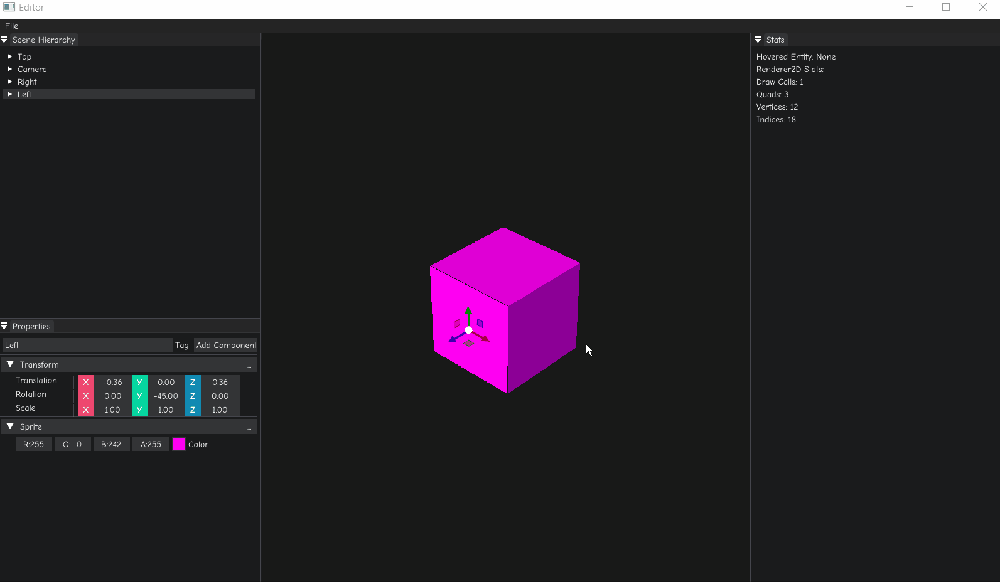

# ZZX Engine

A work-in-progress game engine using OpenGL as the Renderer API.

Current progress: Editor workflow

## Usage

OpenGL Version: **4.6**

C++ Version: **C++17**

Currently only supports Windows, Visual Studio 2019. 

1. Clone the repository: `git clone --recursive https://github.com/zixin96/ZEngine.git`
2. Run `Scripts/Win-GenProj.bat` - this will create `ZZX.sln` and make sure everything is setup correctly
3. Open `ZZX.sln` and build `Debug` `x64` - Editor should be the startup project so really you can just hit `F5` to build and debug the startup project

## Engine Architecture
ZEngine is structured using standard object-oriented approach: abstract base classes are defined for important entities. The majority of the engine is implemented purely in terms of the interfaces provided by these abstract base classes. This approach makes it easy to support multiple platforms and extend the system if necessary.

`Editor` and `Sandbox` are client applications. 

`ZZX` is the core engine.

- Entry point: `EntryPoint.h`
    - contains `main()` that initializes `Log`, creates, runs, and shutdowns the `Application` if necessary. 
- `Application` layer: 
    - contains `IWindow`, `LayerStack`, `ImguiLayer`, etc.
- Window layer
	- Input
	- Events
- Renderer
- Render API (OpenGL) abstraction 
- Debugging support
    - 'Log' class is a wrapper around `spdlog` that outputs log messages to console and `ZZX.log`.
    - Profiling uses `<chrono>` and supports chrome tracing.
- Build system: Premake
  - Precompiled header `zzxpch.h` is used to reduce compilation time.
    - Files that are not frequently modified (such as STL) are included. 
    - Precompiled headers may reduce readability by hiding dependencies. Thus, only some selected headers are included.
- Entity-component system (ECS): `EnTT`

- External libraries:
    - glad: OpenGL Functions Loader
    - glfw: OpenGL Context
    - glm: Math
    - imgui: GUI 
    - spdlog: Logging
    - stb: Texture Loading
    - yaml: scene serialization
    - EnTT: ECS

In-progress:

- C# Scripting language support
- Memory system
- Physics
- File I/O, Virtual File System (VFS)

- If you are stuck at importing ASSIMP, consider watching Modern OpenGL (GLAD) video again!
  
  
## References

[1] Hazel. Hazel Engine by TheCherno. 
    Used under Apache-2.0 License.
    https://github.com/TheCherno/Hazel.git

[2] OpenGL. OpenGL support library so you can just dive in and write OpenGL code by TheCherno.
    Used under Apache-2.0 License.
    https://github.com/TheCherno/OpenGL.git

[3] Game Engine Series. Youtube series by TheCherno. 
    https://youtube.com/playlist?list=PLlrATfBNZ98dC-V-N3m0Go4deliWHPFwT

## TODOs

- Materials system
- PBR